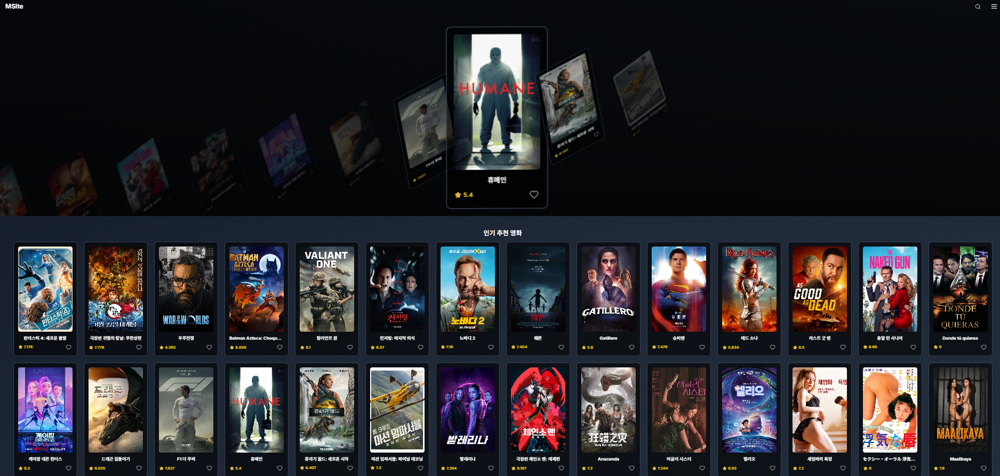

# 🎬 영화 리스트 웹사이트

React와 TailwindCSS를 활용해 제작 중인 영화 리스트 사이트입니다.

---

## 👤 프로젝트 개요

- **개발 인원:** 1인 (개인 프로젝트)
- **제작 기간:** 약 1개월(예상)
- **진행 방식:** 기능별/컴포넌트별로 분리하여 개발

---

## 🛠️ 사용 기술

- React (함수형 컴포넌트)
- JavaScript (ES6+)
- TailwindCSS
- useEffect, useState 등 React Hook 활용

---

## 📝 주요 기능

- 영화 카드 리스트 UI 구현
- 영화 정보를 불러와 리스트 형태로 렌더링 (TMDB API)
- useEffect를 활용한 슬라이드(캐러셀) 애니메이션 효과
- (향후) 상세 페이지, 검색, 필터, 즐겨찾기 등 추가 예정

```plaintext
OZ_REACT_PJ/
├─ public/
│ ├─ movieDetailData.json
│ ├─ movieListData.json
│ └─ vite.svg
├─ src/
│ ├─ assets/
│ ├─ component/
│ │ ├─ layout/
│ │ │ └─ Layout.jsx
│ │ ├─ moviecard/
│ │ │ └─ MovieCard.jsx
│ │ ├─ moviedetail/
│ │ │ └─ MovieDetail.jsx
│ │ ├─ moviegrid/
│ │ │ └─ MovieGrid.jsx
│ │ ├─ movielist/
│ │ │ └─ MovieList.jsx
│ │ ├─ navbar/
│ │ │ └─ NavBar.jsx
│ │ ├─ pages/
│ │ │ ├─ Login.jsx
│ │ │ ├─ Signup.jsx
│ │ │ └─ MovieCylinder.jsx
│ │ ├─ slider/
│ │ │ └─ MovieCylinder.jsx
│ │ ├─ inputfield.jsx
│ ├─ hooks/
│ │ └─ useDebounce.jsx
│ ├─ App.jsx
│ ├─ App.css
│ ├─ index.js
│ ├─ index.css
│ ├─ main.jsx
│ └─ supabase/
├─ .env
├─ .gitignore
├─ index.html
├─ package.json
├─ package-lock.json
├─ postcss.config.js
├─ README.md
├─ tailwind.config.js
├─ vite.config.js
```

## 🖼️ 스크린샷

> **예시 스크린샷은 아래 경로에 넣어주세요.**
>
> 

---

## 🏃‍♂️ 실행 방법

1. 프로젝트를 클론하거나 다운로드합니다.
2. 의존성 설치:  
   npm install
개발 서버 실행:
npm run dev
브라우저에서 http://localhost:5173 접속

💡 기타
본 프로젝트는 포트폴리오 및 학습 목적으로 개인 개발 중입니다.

스타일링은 TailwindCSS를 적극적으로 활용했습니다.

구현/개선하고 싶은 기능이나 디자인 아이디어가 있다면 언제든 제안해주세요!

---

**진행상황이나 기능 추가, 기술스택, 이미지, 기타 정보** 등  
추가 요청사항 있으면 언제든 말씀해 주세요!  
